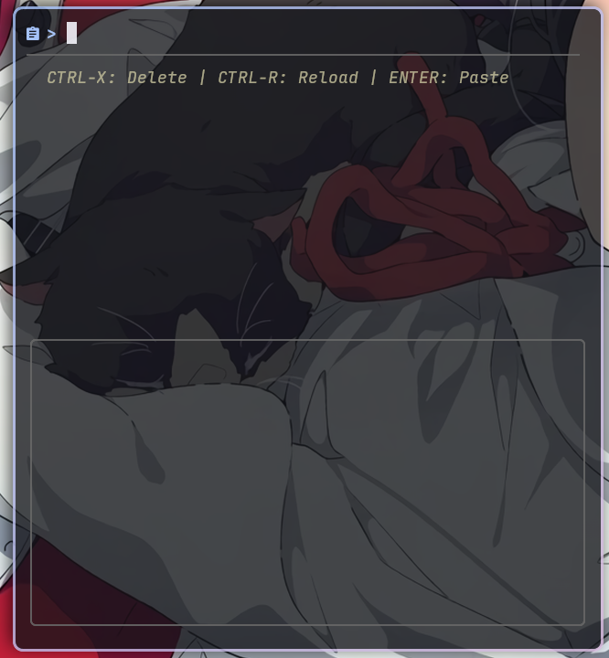
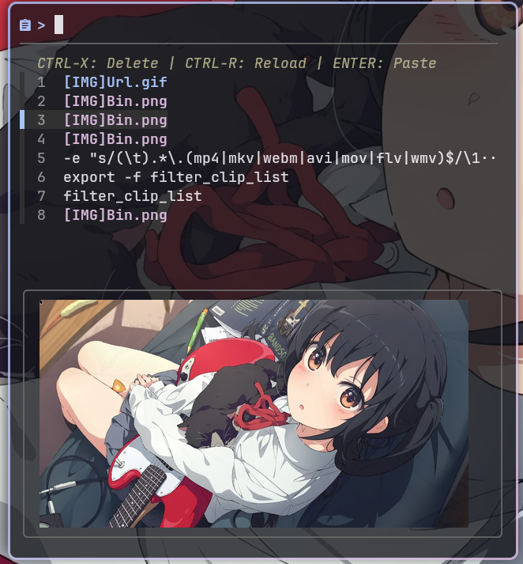

# shorinclip

My first bash script.

A wayland clipboard TUI based on `fzf` `wl-clipboad` `cliphist`. Use `kitty icat` for image preview and `ffmpegthumbnailer` for video thumb generation.

- installation

    ```
    yay -S shorinclip
    ```

- useage

    Open cliphist daemon with this command:
  
    ```
    wl-paste --watch cliphist store
    ```
    
    Open tui with:`shorinclip`

    Then it just work. Also setup autostart in your wayland compositor's config file.


    For image preview, you need to install a terminal which supports `kitty icat` such as `kitty` or `ghostty`.


- some image

    

    